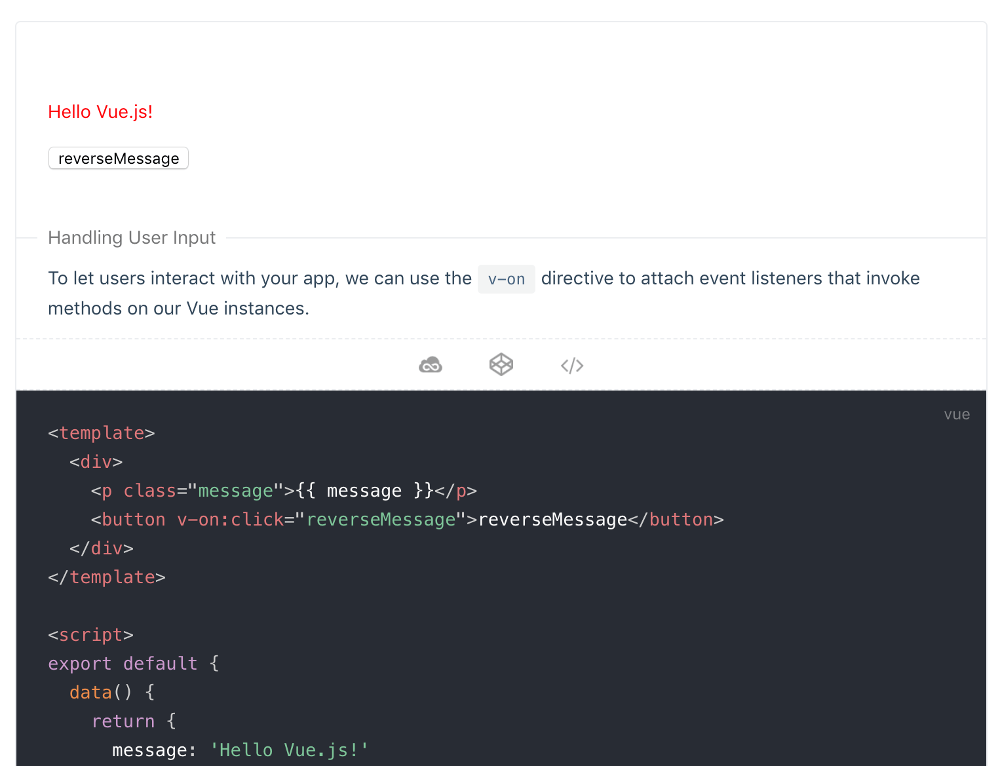

# vue-demo-box

vue-demo-box provides a container component that presents both the demo and the code. For more demonstrations, check out the [Example](./example).

Recommended to use with [Vuepress import code snippets](https://vuepress.vuejs.org/guide/markdown.html#import-code-snippets) to make it easier to reuse the code to create a presentation:

<!-- markdownlint-disable MD033 -->


## Install

```bash
yarn add -D @laomao800/vue-demo-box

# or

npm install --save-dev @laomao800/vue-demo-box
```

## Documentation

[中文](https://laomao800.github.io/vue-demo-box/zh/) | [English](https://laomao800.github.io/vue-demo-box/)
